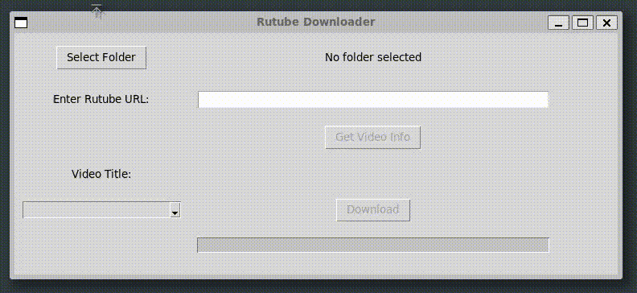

English / [Russian](./README_RU.md)
# What is it?

Small project with one main function - download a video from RuTube(it's a russian copy of YouTube).

## How to use it?

- Simple way: Download executable file from [Releases](https://github.com/Reagent992/async_rutube_downloader/releases/latest).
- Hard way: clone repo, install dependencies(poetry), run `run_ui.py`

# About
- This project was created for learning purposes and was inspired by a similar synchronous library and a book about async.
- The async version allows you to use the full speed of your internet connection.

## Technical Features
- Progress bar displays the real download progress.
- UI and loading work in different threads.

# Used libs

| title                                                           | description                      |
| --------------------------------------------------------------- | -------------------------------- |
| [m3u8](https://github.com/globocom/m3u8/)                       | Used for playlist parsing        |
| [aiohttp](https://github.com/aio-libs/aiohttp)                  | Async http client                |
| [aiofiles](https://github.com/Tinche/aiofiles)                  | async work with files            |
| [PyInstaller](https://github.com/pyinstaller/pyinstaller)       | Create executable files          |
| [slugify ](https://github.com/un33k/python-slugify)             | Convert video title to file name |
| [CustomTkinter](https://github.com/TomSchimansky/CustomTkinter) | Better TKinter UI                |

# Dev notes
- Looks like python installed by **UV** doesn't provide **Tkinter** support. So i've switched to **poetry** and **pyenv**.
- build `poetry run pyinstaller ./src/run_ui.py  --path ./src/ --clean --onefile --noconsole`

## TODO

- [x] Make a download stable.
- [x] basic refactoring.
- [x] test speed with processing. no improvements.
- [x] Update Downloader to work with UI.
- [x] UI by Tkinter. To make a responsive UI - Tkinter should be in main thread, when asyncio event loop should be in separate thread.
- [x] Check m3u8 didn't make sync connections. [link](https://github.com/globocom/m3u8/wiki/FAQ#how-to-use-a-custom-python-http-client)
looks like we need swap `load()` with `loads(m3u8: str)` and download m3u8 async by aiohttp.
- [x] timeouts for download.
- [x] Use only one `ClientSession` in `Downloader`.
- [x] fix "invalid url" with http://
- [x] long video title breaks UI
- [x] printable video title and safe-file-name title must be different
- [x] fix "Unclosed connector"
- [x] tests
- [x] Make the UI less ugly.
- [ ] add video thumbnail in UI
- [ ] russian ui.
- [ ] cli client("in process" and quality choose.).
- [ ] Mass download support.
- [ ] Cancel download (method and button for ui)
- [ ] pypi library.
- [ ] shorts support
