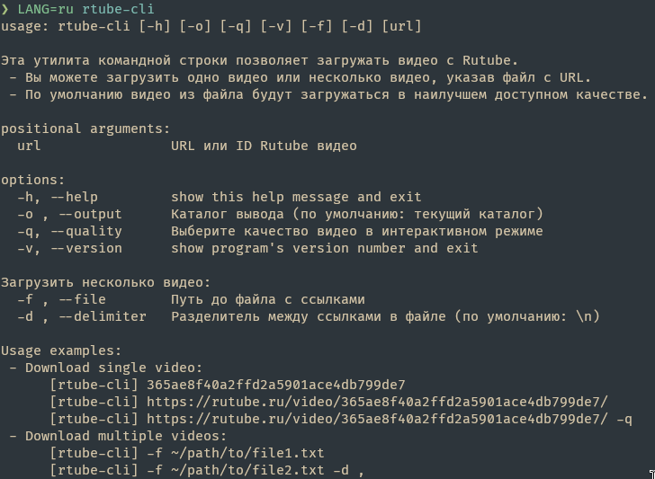

[](https://github.com/Reagent992/async_rutube_downloader/releases/latest)
[](https://github.com/Reagent992/async_rutube_downloader/actions/workflows/tests.yml)
[](https://coveralls.io/github/Reagent992/async_rutube_downloader?branch=main)
[](https://github.com/Reagent992/async_rutube_downloader/releases/latest)
[](https://pypi.org/project/async_rutube_downloader/)

[English](README.md) / Russian

# Что это?

Небольшой проект с одной основной функцией - скачивание видео с RuTube.

## Как пользоваться?

### Графический пользовательский интерфейс

-  [Скачать исполняемый файл в разделе релизы(Releases)](https://github.com/Reagent992/async_rutube_downloader/releases/latest)

[](https://github.com/Reagent992/async_rutube_downloader/releases/latest)

### Консольный интерфейс

1. Установить библиотеку
```
pip install async_rutube_downloader
```
2. Запустить
```
rtube-cli https://rutube.ru/video/365ae8f40a2ffd2a5901ace4db799de7/
```
[](https://pypi.org/project/async_rutube_downloader/)

### Использование в коде

1. Установить библиотеку
```
pip install async_rutube_downloader
```
2. Пример загрузки видео из кода.
```python
import asyncio
from async_rutube_downloader.downloader import Downloader

async def download():
    downloader = Downloader(
        "https://rutube.ru/video/365ae8f40a2ffd2a5901ace4db799de7/"
    )
    qualities = await downloader.fetch_video_info()
    await downloader.select_quality(max(qualities.keys()))
    await downloader.download_video()

asyncio.run(download())
```


### [Установка исходного кода проекта](./dev.md)


# О проекте
Этот проект был создан в учебных целях и был вдохновлен аналогичной синхронной библиотекой и книгой по асинхронному программированию.

## Технические особенности
- Графический пользовательский интерфейс(GUI) на TKinter.
- Интерфейс командной строки с использованием `argparse`(Из стандартной библиотеки)
- Честный прогресс бар, он отображает реальный прогресс загрузки.
- UI и загрузка работают в разных потоках.
- Перевод UI.
- Асинхронная версия позволяет использовать полную скорость интернет-соединения.
- [PyInstaller](https://github.com/pyinstaller/pyinstaller) используется для создания исполняемого файла

## Зависимости

| title                                                           | description                               |
| --------------------------------------------------------------- | ----------------------------------------- |
| [m3u8](https://github.com/globocom/m3u8/)                       | Используется для парсинга плейлистов      |
| [aiohttp](https://github.com/aio-libs/aiohttp)                  | асинхронный http клиент                   |
| [aiofiles](https://github.com/Tinche/aiofiles)                  | асинхронная работа с файлами              |
| [slugify ](https://github.com/un33k/python-slugify)             | Преобразование названия видео в имя файла |
| [CustomTkinter](https://github.com/TomSchimansky/CustomTkinter) | Better TKinter UI                         |
