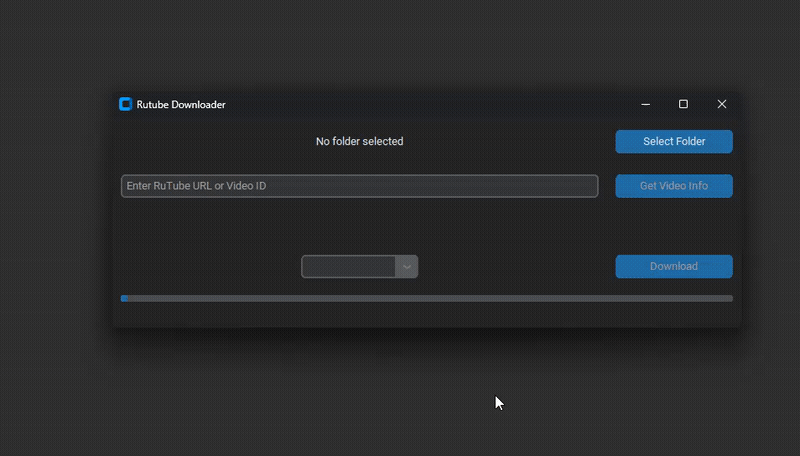

[English](README.md) / Russian

# Что это?

Небольшой проект с одной основной функцией - скачивание видео с RuTube.

## Как пользоваться?
- Легкий вариант: Скачать исполняемый файл в разделе релизы(Releases)
- Сложный вариант: скопировать репозиторий, установить зависимости(poetry), запустить `main.py`

# О проекте
- Этот проект был создан в учебных целях и был вдохновлен аналогичной синхронной библиотекой и книгой по асинхронному программированию.
- Асинхронная версия позволяет использовать полную скорость интернет-соединения.

## Технические особенности
- Честный прогресс бар, он отображает реальный прогресс загрузки.
- UI и загрузка работают в разных потоках.

# Используемые библиотеки:

| title                                                           | description                               |
| --------------------------------------------------------------- | ----------------------------------------- |
| [m3u8](https://github.com/globocom/m3u8/)                       | Используется для парсинга плейлистов      |
| [aiohttp](https://github.com/aio-libs/aiohttp)                  | асинхронный http клиент                   |
| [aiofiles](https://github.com/Tinche/aiofiles)                  | асинхронная работа с файлами              |
| [PyInstaller](https://github.com/pyinstaller/pyinstaller)       | Создание исполняемого файла               |
| [slugify ](https://github.com/un33k/python-slugify)             | Преобразование названия видео в имя файла |
| [CustomTkinter](https://github.com/TomSchimansky/CustomTkinter) | Better TKinter UI                         |